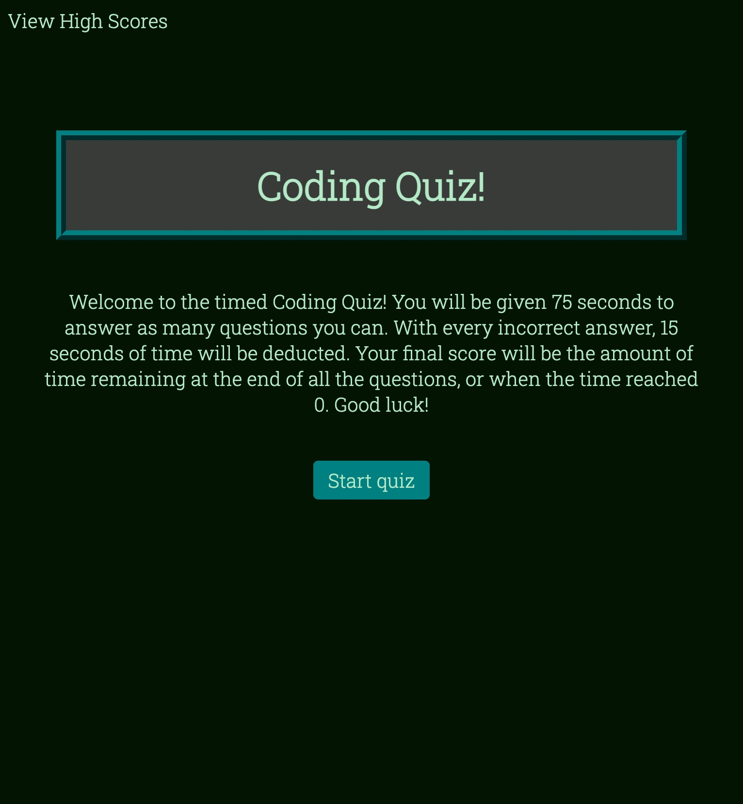

# JavaScript Coding Quiz

## Description

This project is a timed, multiple choice coding quiz. The timer is set to 75 seconds and counts down when the quiz begins. Every incorrect answer results in 15 seconds of time deducted. The score, also the timer, hits 0 and the game is over. If the player finishes the quiz before time runs out, the time remaining is the final score. This application also includes a high scores page where the player can input their name and have it show on the scoreboard. The purpose of this project is to use JavaScript to create a dynamically updated HTML and CSS code. 

## Mock-Up

The following animation demonstrates the application functionality:

## Application Link
